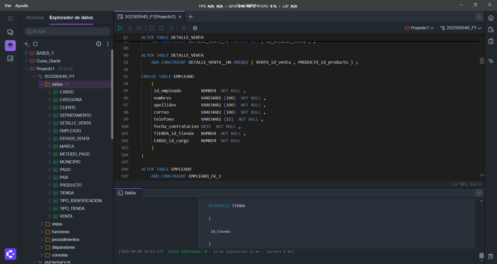
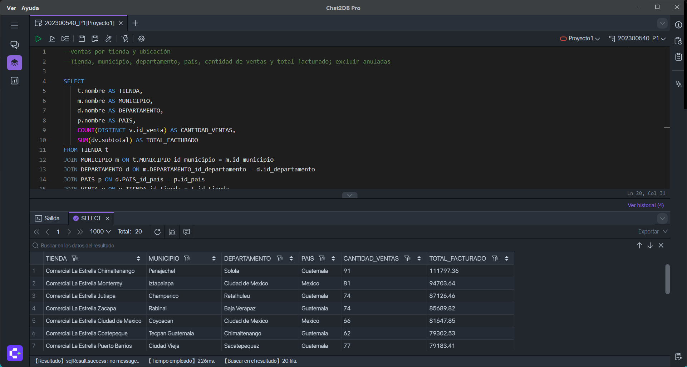
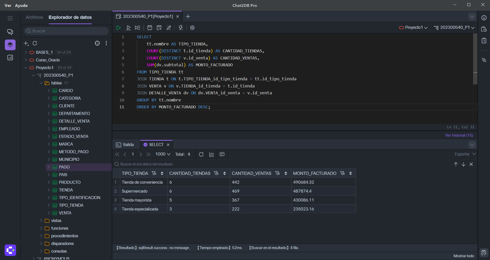
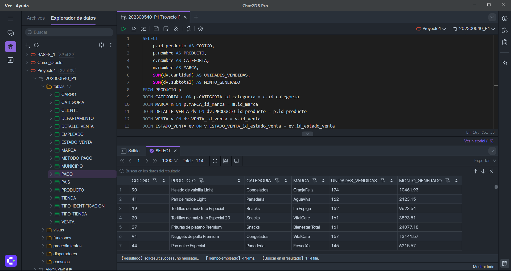
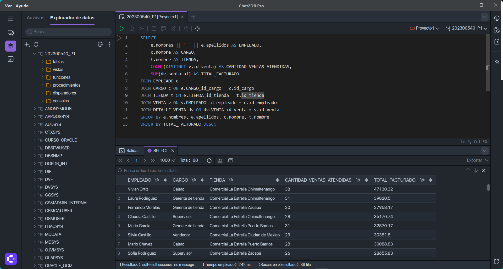
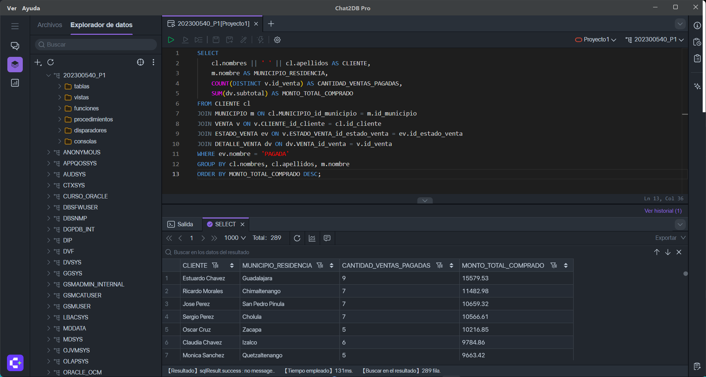
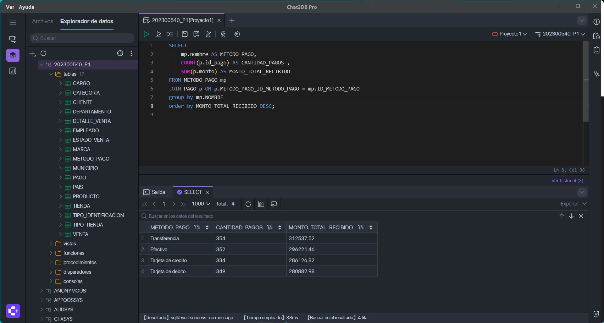

# Manual Técnico — Proyecto 1
### Sistema de Control de Ventas — Comercial La Estrella
**Bases de Datos 1 · Carné: 202300540**

---

## 1. Herramientas utilizadas

- **Motor de base de datos:** Oracle Database 21c .
- **Herramienta de modelado:** Oracle SQL Data Modeler — modelo conceptual, lógico y relacional.
- **Herramienta de consultas y ejecución:** Chat2DB, conectado a un esquema/usuario dedicado (`202300540_P1`).
- **Origen de datos:** archivo Excel `Copia_de_dataset_comercial_la_estrella.xlsx`.

---

## 2. Proceso de modelado

1. Se analizó el enunciado y se identificaron 17 entidades: 10 catálogos (país, departamento, municipio, tipo de tienda, cargo, tipo de identificación, categoría, marca, estado de venta, método de pago) y 7 entidades principales/transaccionales (tienda, empleado, cliente, producto, venta, detalle de venta, pago).
2. Se construyó el **modelo lógico** en Oracle SQL Data Modeler, definiendo llaves primarias, atributos obligatorios/opcionales según las reglas de negocio, y las 18 relaciones 1:N correspondientes.
3. Se generó el **modelo relacional** con *Engineer to Relational Model*, agregando manualmente las restricciones que Data Modeler no infiere automáticamente:
   - 6 restricciones **UNIQUE** (simples y compuestas): `PAIS.nombre`, `EMPLEADO.correo`, `DEPARTAMENTO(nombre, id_pais)`, `MUNICIPIO(nombre, id_departamento)`, `CLIENTE(tipo_ident, numero_identificacion)`, `DETALLE_VENTA(id_venta, id_producto)`.
   - 6 restricciones **CHECK**: `PRODUCTO.precio_vigente > 0`, `PRODUCTO.existencia >= 0`, `DETALLE_VENTA.cantidad > 0`, `DETALLE_VENTA.precio_unitario > 0`, `PAGO.monto > 0`, `EMPLEADO.fecha_contratacion <= SYSDATE`.

### Ajustes realizados durante el modelado

- Se corrigió la columna `TIPO_IDENTIFICACION_id_tipo_ident` de `CLIENTE` (generaba error de longitud de nombre &gt;30 caracteres al combinar el nombre de la tabla origen con la PK) a `TIPO_IDENT_id_tipo_ident`.
- Se generó el DDL seleccionando **Oracle Database 21c** como destino, ya que las versiones nuevas de Oracle permiten nombres de restricción de hasta 128 caracteres, evitando el error de longitud en nombres de FK largos como `CLIENTE_TIPO_IDENTIFICACION_FK`.
- Se revisaron y ajustaron los atributos marcados por defecto como obligatorios en Data Modeler, dejando como opcionales `CLIENTE.correo`, `CLIENTE.telefono`, `TIENDA.telefono`, `EMPLEADO.telefono` y `PRODUCTO.descripcion`.

### MODELADO CONCEPTUAL


### MODELADO LOGICO


### MODELADO RELACIONAL


---

## 3. Ejecución del script DDL

El script `03_creacion_DB.sql` se ejecutó sobre un esquema Oracle nuevo y vacío (`202300540_P1`), creado específicamente para este proyecto:



Tras ejecutar el DDL completo, se verificó la creación correcta con:

```sql
SELECT COUNT(*) AS TOTAL_TABLAS FROM user_tables;              -- 17
SELECT constraint_type, COUNT(*) FROM user_constraints GROUP BY constraint_type;
-- P (Primary Key) = 17 | R (Foreign Key) = 18 | U (Unique) = 6 | C (Check + NOT NULL) = 70
```

---

## 4. Carga de datos

### 4.1 Diferencia entre el dataset y el modelo diseñado

El archivo de datos original manejaba dos estructuras que no coinciden literalmente con el esquema definido a partir del enunciado:

1. **Tabla `PERSONA` compartida**: el dataset almacenaba nombre, apellido, teléfono, correo y municipio en una sola tabla `PERSONA`, referenciada tanto por `EMPLEADO` como por `CLIENTE`. El modelo de este proyecto, siguiendo el enunciado, guarda esos datos directamente en cada entidad. Se resolvió cruzando `PERSONA` con `EMPLEADO` y con `CLIENTE` por su llave (`ID_PER`) al momento de generar los archivos de carga, para obtener los datos ya combinados por entidad.

2. **Tabla `CATALOGO_PRODUCTO` (precio y existencia por tienda)**: el dataset registraba un precio y una existencia distintos para cada producto **en cada tienda** donde se vende. El enunciado, en cambio, define `precio_vigente` y `existencia` como atributos únicos de `PRODUCTO` (un solo valor por producto). Se decidió **mantener el diseño del esquema tal como se definió a partir del enunciado**, sin agregar una tabla de precio por tienda, ya que el enunciado indica explícitamente que no se admite ningún supuesto adicional que lo contradiga. Para consolidar la información: `precio_vigente` = promedio de los precios del producto entre todas las tiendas donde se vende; `existencia` = suma de las existencias del producto en todas las tiendas.

### 4.2 Orden de importación

Se respetó el siguiente orden para no violar la integridad referencial:

1. PAIS
2. TIPO_TIENDA
3. TIPO_IDENTIFICACION
4. CARGO
5. CATEGORIA
6. MARCA
7. ESTADO_VENTA
8. METODO_PAGO
9. DEPARTAMENTO
10. MUNICIPIO
11. TIENDA
12. PRODUCTO
13. EMPLEADO
14. CLIENTE
15. VENTA
16. DETALLE_VENTA
17. PAGO

### 4.3 Método de carga

Se utilizó el asistente de importación de datos de Chat2DB (tabla por tabla, seleccionando el CSV correspondiente y confirmando el mapeo automático de columnas, ya que los encabezados de cada CSV se ajustaron previamente para coincidir exactamente con los nombres de columna de cada tabla). Se verificaron los conteos finales contra el total de registros de cada hoja del Excel original, confirmando que no se perdió ningún registro en el proceso.

---

## 5. Validación de reglas de negocio no declarativas

Dos reglas del enunciado no se pueden garantizar únicamente con restricciones (`PRIMARY KEY`, `FOREIGN KEY`, `CHECK`), por lo que se verificaron mediante consulta SQL, tal como lo permite el alcance del proyecto:

### Validación 1 — El empleado que atiende una venta debe pertenecer a la misma tienda donde se registra

```sql
SELECT v.id_venta, v.TIENDA_id_tienda AS tienda_venta, e.TIENDA_id_tienda AS tienda_empleado
FROM VENTA v
JOIN EMPLEADO e ON v.EMPLEADO_id_empleado = e.id_empleado
WHERE v.TIENDA_id_tienda != e.TIENDA_id_tienda;
```

**Resultado:** 0 filas devueltas — no existen ventas donde el empleado pertenezca a una tienda distinta a la de la venta.

### Validación 2 — La suma de pagos de una venta PAGADA debe corresponder al total de sus detalles

```sql
SELECT 
    v.id_venta, ev.nombre AS estado,
    SUM(dv.subtotal) AS total_venta,
    NVL((SELECT SUM(p.monto) FROM PAGO p WHERE p.VENTA_id_venta = v.id_venta), 0) AS total_pagado
FROM VENTA v
JOIN ESTADO_VENTA ev ON v.ESTADO_VENTA_id_estado_venta = ev.id_estado_venta
JOIN DETALLE_VENTA dv ON dv.VENTA_id_venta = v.id_venta
WHERE ev.nombre = 'PAGADA'
GROUP BY v.id_venta, ev.nombre
HAVING SUM(dv.subtotal) != NVL((SELECT SUM(p.monto) FROM PAGO p WHERE p.VENTA_id_venta = v.id_venta), 0);
```

**Resultado:** 0 filas devueltas — todas las ventas en estado PAGADA tienen pagos que cuadran exactamente con su total.

---

## 6. Consultas de reportes

### Consulta 1 — Ventas por tienda y ubicación

```sql
SELECT 
    t.nombre AS TIENDA, m.nombre AS MUNICIPIO, d.nombre AS DEPARTAMENTO, p.nombre AS PAIS,
    COUNT(DISTINCT v.id_venta) AS CANTIDAD_VENTAS, SUM(dv.subtotal) AS TOTAL_FACTURADO
FROM TIENDA t
JOIN MUNICIPIO m ON t.MUNICIPIO_id_municipio = m.id_municipio
JOIN DEPARTAMENTO d ON m.DEPARTAMENTO_id_departamento = d.id_departamento
JOIN PAIS p ON d.PAIS_id_pais = p.id_pais
JOIN VENTA v ON v.TIENDA_id_tienda = t.id_tienda
JOIN ESTADO_VENTA ev ON v.ESTADO_VENTA_id_estado_venta = ev.id_estado_venta
JOIN DETALLE_VENTA dv ON dv.VENTA_id_venta = v.id_venta
WHERE ev.nombre != 'ANULADA'
GROUP BY t.nombre, m.nombre, d.nombre, p.nombre
ORDER BY TOTAL_FACTURADO DESC;
```



### Consulta 2 — Ventas por tipo de tienda

```sql
SELECT 
    tt.nombre AS TIPO_TIENDA,
    COUNT(DISTINCT t.id_tienda) AS CANTIDAD_TIENDAS,
    COUNT(DISTINCT v.id_venta) AS CANTIDAD_VENTAS,
    SUM(dv.subtotal) AS MONTO_FACTURADO
FROM TIPO_TIENDA tt
JOIN TIENDA t ON t.TIPO_TIENDA_id_tipo_tienda = tt.id_tipo_tienda
JOIN VENTA v ON v.TIENDA_id_tienda = t.id_tienda
JOIN DETALLE_VENTA dv ON dv.VENTA_id_venta = v.id_venta
GROUP BY tt.nombre
ORDER BY MONTO_FACTURADO DESC;
```



### Consulta 3 — Productos más vendidos

```sql
SELECT 
    p.id_producto AS CODIGO, p.nombre AS PRODUCTO, c.nombre AS CATEGORIA, m.nombre AS MARCA,
    SUM(dv.cantidad) AS UNIDADES_VENDIDAS, SUM(dv.subtotal) AS MONTO_GENERADO
FROM PRODUCTO p
JOIN CATEGORIA c ON p.CATEGORIA_id_categoria = c.id_categoria
JOIN MARCA m ON p.MARCA_id_marca = m.id_marca
JOIN DETALLE_VENTA dv ON dv.PRODUCTO_id_producto = p.id_producto
JOIN VENTA v ON dv.VENTA_id_venta = v.id_venta
JOIN ESTADO_VENTA ev ON v.ESTADO_VENTA_id_estado_venta = ev.id_estado_venta
WHERE ev.nombre != 'ANULADA'
GROUP BY p.id_producto, p.nombre, c.nombre, m.nombre
ORDER BY UNIDADES_VENDIDAS DESC;
```



### Consulta 4 — Desempeño de empleados

```sql
SELECT 
    e.nombres || ' ' || e.apellidos AS EMPLEADO, c.nombre AS CARGO, t.nombre AS TIENDA,
    COUNT(DISTINCT v.id_venta) AS CANTIDAD_VENTAS_ATENDIDAS, SUM(dv.subtotal) AS TOTAL_FACTURADO
FROM EMPLEADO e
JOIN CARGO c ON e.CARGO_id_cargo = c.id_cargo
JOIN TIENDA t ON e.TIENDA_id_tienda = t.id_tienda
JOIN VENTA v ON v.EMPLEADO_id_empleado = e.id_empleado
JOIN DETALLE_VENTA dv ON dv.VENTA_id_venta = v.id_venta
GROUP BY e.nombres, e.apellidos, c.nombre, t.nombre
ORDER BY TOTAL_FACTURADO DESC;
```



### Consulta 5 — Clientes con mayor compra

```sql
SELECT 
    cl.nombres || ' ' || cl.apellidos AS CLIENTE, m.nombre AS MUNICIPIO_RESIDENCIA,
    COUNT(DISTINCT v.id_venta) AS CANTIDAD_VENTAS_PAGADAS, SUM(dv.subtotal) AS MONTO_TOTAL_COMPRADO
FROM CLIENTE cl
JOIN MUNICIPIO m ON cl.MUNICIPIO_id_municipio = m.id_municipio
JOIN VENTA v ON v.CLIENTE_id_cliente = cl.id_cliente
JOIN ESTADO_VENTA ev ON v.ESTADO_VENTA_id_estado_venta = ev.id_estado_venta
JOIN DETALLE_VENTA dv ON dv.VENTA_id_venta = v.id_venta
WHERE ev.nombre = 'PAGADA'
GROUP BY cl.nombres, cl.apellidos, m.nombre
ORDER BY MONTO_TOTAL_COMPRADO DESC;
```



### Consulta 6 — Facturación por categoría y marca

```sql
SELECT 
    c.nombre AS CATEGORIA, m.nombre AS MARCA,
    SUM(dv.cantidad) AS UNIDADES_VENDIDAS, SUM(dv.subtotal) AS TOTAL_FACTURADO
FROM CATEGORIA c
JOIN PRODUCTO p ON p.CATEGORIA_id_categoria = c.id_categoria
JOIN MARCA m ON p.MARCA_id_marca = m.id_marca
JOIN DETALLE_VENTA dv ON dv.PRODUCTO_id_producto = p.id_producto
GROUP BY c.nombre, m.nombre
ORDER BY TOTAL_FACTURADO DESC;
```


### Consulta 7 — Uso de métodos de pago

```sql
SELECT 
    mp.nombre AS METODO_PAGO,
    COUNT(p.id_pago) AS CANTIDAD_PAGOS, SUM(p.monto) AS MONTO_TOTAL_RECIBIDO
FROM METODO_PAGO mp
JOIN PAGO p ON p.METODO_PAGO_id_metodo_pago = mp.id_metodo_pago
GROUP BY mp.nombre
ORDER BY MONTO_TOTAL_RECIBIDO DESC;
```



### Consulta 8 — Ventas pendientes de pago

```sql
SELECT 
    v.id_venta AS VENTA,
    dv_totales.total_venta AS TOTAL_VENTA,
    NVL(pg_totales.total_pagado, 0) AS TOTAL_PAGADO,
    dv_totales.total_venta - NVL(pg_totales.total_pagado, 0) AS DIFERENCIA_PENDIENTE
FROM VENTA v
JOIN ESTADO_VENTA ev ON v.ESTADO_VENTA_id_estado_venta = ev.id_estado_venta
JOIN (
    SELECT VENTA_id_venta, SUM(subtotal) AS total_venta
    FROM DETALLE_VENTA GROUP BY VENTA_id_venta
) dv_totales ON dv_totales.VENTA_id_venta = v.id_venta
LEFT JOIN (
    SELECT VENTA_id_venta, SUM(monto) AS total_pagado
    FROM PAGO GROUP BY VENTA_id_venta
) pg_totales ON pg_totales.VENTA_id_venta = v.id_venta
WHERE ev.nombre = 'REGISTRADA'
ORDER BY DIFERENCIA_PENDIENTE DESC;
```


---

## 7. Solicion del problema

Se diseñó e implementó un modelo relacional normalizado hasta 3FN con 17 tablas, cubriendo la totalidad de entidades, catálogos y reglas de negocio. Se cargaron los datos reales proporcionados por la cátedra, adaptando su estructura de origen (tabla `PERSONA` compartida y precios por tienda) al diseño definido a partir del enunciado, documentando cada decisión tomada. Se validaron las 2 reglas de negocio no declarativas mediante consulta SQL, y se desarrollaron las 8 consultas de reportes solicitadas utilizando `JOIN`, funciones de agregación, subconsultas en el `FROM` y `LEFT JOIN` con `NVL` para el manejo de casos sin coincidencia.
